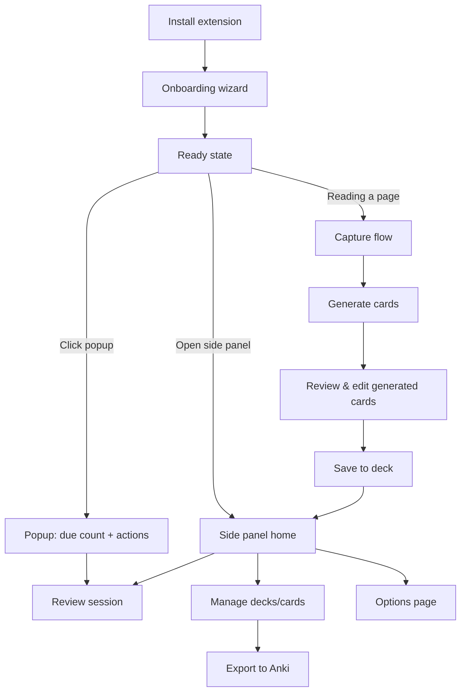
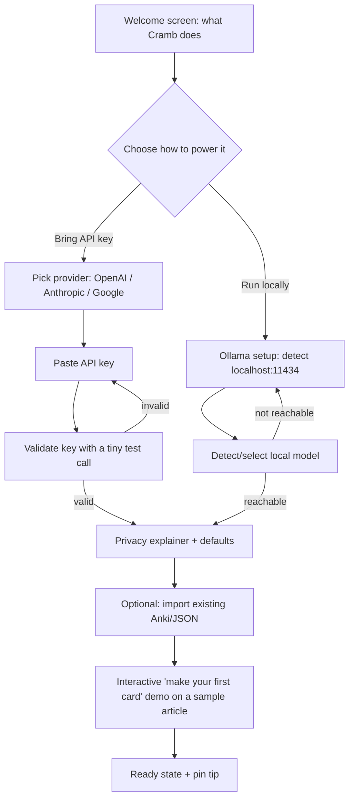
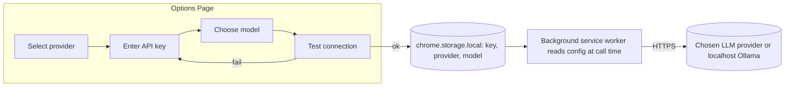
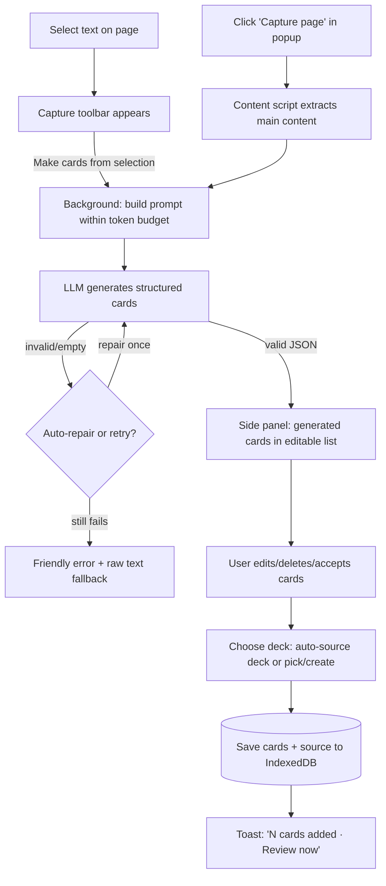
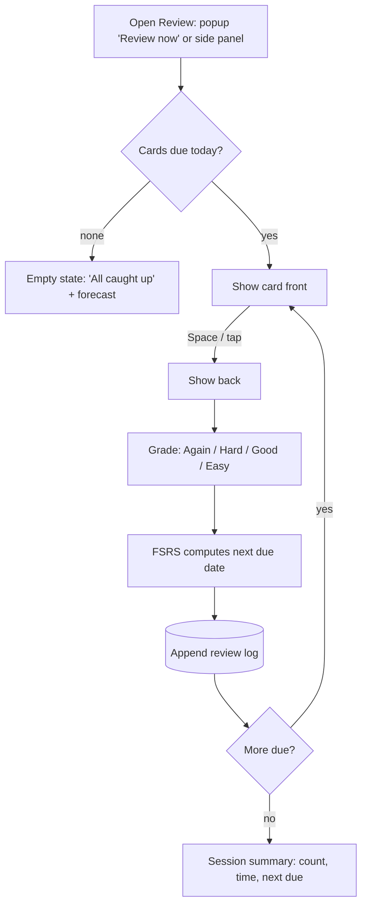
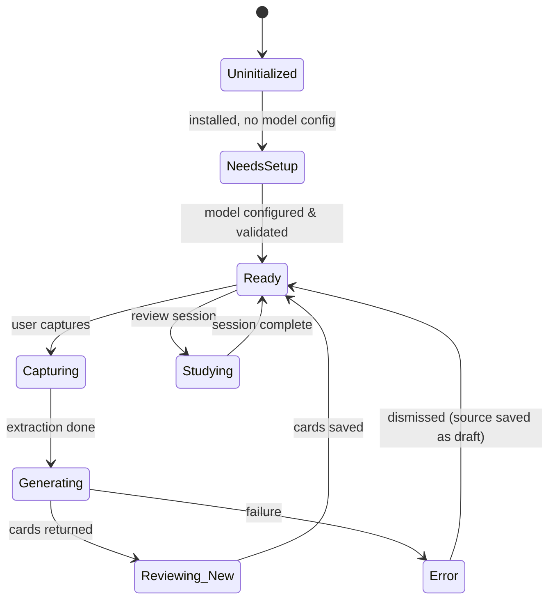

# Cramb — App Flow / User Flow

> **Status:** Draft v0.1 · **Last updated:** 2026-06-20
> Mermaid diagrams render natively on GitHub.

**Answers the question:** *How does a user move through the product?*

---

## 1. Surfaces (where the UI lives)

A browser extension is not a single screen — it's a set of surfaces. Cramb uses five:

| Surface | Tech | Purpose |
|---------|------|---------|
| **In-page capture toolbar** | Content script (injected) | Appears on text selection / page action; the entry point to capture. |
| **Popup** | Extension popup | Quick status: due-count, "Review now", "Capture this page", settings link. |
| **Side panel** | `chrome.sidePanel` / Firefox sidebar | The main workspace: card review, generated-card editing, decks. |
| **Options page** | Extension page (full tab) | Settings: provider/key, limits, theme, data import/export. |
| **Onboarding page** | Extension page (full tab) | First-run setup wizard. |

Navigation principle: **capture happens in-page; everything else happens in the side panel.** The popup is a launcher, not a workspace.

---

## 2. Top-level map



---

## 3. Onboarding flow (first run)

Triggered automatically on install (opens a full-tab onboarding page). Goal: **time-to-first-card ≤ 3 minutes.**



**Design notes**
- The provider choice screen states plainly: *"Your key and your reading stay on your device. Cramb talks directly to the provider you choose and nowhere else."*
- Key validation does a minimal, cheap completion to confirm the key + model work, surfacing errors immediately (bad key, no quota, wrong region).
- Onboarding is **skippable** but capture is gated on a working model config — if a user skips, the first capture re-prompts for setup (see §7 Edge cases).
- We show the keyboard shortcut and how to pin the extension at the end.

---

## 4. "Authentication" flow (BYO-key model)

Cramb has **no accounts** in v1. "Auth" means *configuring access to a model provider.* This section documents it as the auth flow the PRD references.



**Rules (enforced; see CLAUDE.md guardrails):**
- The API key is written to `chrome.storage.local` (device-local, not synced).
- The key is **only** read inside the background service worker, **never** exposed to content scripts or page context, and **never** logged.
- All model calls originate from the background SW over HTTPS (or `http://localhost` for Ollama).
- Switching providers is non-destructive — cards/decks are provider-agnostic.

---

## 5. Capture flow (the core loop)

The single most important flow. Two entry points converge.



**Details**
- **Extraction:** articles use Readability to isolate main content and strip nav/ads; selections use the raw selected text plus light page context (title, URL).
- **Token budget:** long pages are chunked; the prompt enforces a max card count (default ~8 per capture, configurable) to prevent runaway generation.
- **Source record:** every capture creates/updates a `source` (title, URL, author, captured-at, summary) so cards trace back to where they came from.
- **Card types generated:** basic Q&A + cloze deletions by default; quiz MCQs in quiz mode (F12).
- **Always editable:** generated cards never auto-commit. This is a hard product rule — trust depends on it.

---

## 6. Review flow



**Details**
- Grading via mouse/touch or keys `1`=Again, `2`=Hard, `3`=Good, `4`=Easy; `Space` reveals.
- Daily limits: new-card and review caps prevent overwhelm; configurable.
- Offline: review works fully offline (scheduling is local). Only *generation* needs the network (or local Ollama).
- Undo: last grade can be undone within the session.

---

## 7. Edge cases & error states

A product is its edge cases. Each must have a defined, friendly behavior.

| Scenario | Behavior |
|----------|----------|
| **No model configured** at capture time | Block generation; inline prompt: "Set up a model to generate cards" → deep-link to Options. Capture text is preserved so nothing is lost. |
| **Invalid / expired API key** | Surface provider error verbatim + plain-language hint ("Your key may be invalid or out of quota"). Link to Options. |
| **Rate limited (429)** | Exponential backoff with a visible "retrying" state; after N tries, offer "try again later" and keep the captured text queued. |
| **Provider/network down** | Fail gracefully; captured source is saved as a draft so the user can regenerate later. |
| **Empty / unparseable page** (Readability finds nothing) | Fall back to selection-only; if no selection, ask the user to highlight the part they want. |
| **Paywalled / login-walled content** | We only ever read what's already rendered in the user's tab; if content is absent, show the empty-page path. No bypass attempts. |
| **Very long page** | Chunk + summarize-then-generate; cap total cards; tell the user it was truncated. |
| **PDF viewer / unsupported surface** | Detect and show "This page type isn't supported yet — paste text or use selection." (PDF is a roadmap item.) |
| **Duplicate cards** | On save, near-duplicate detection warns and offers to skip dupes. |
| **YouTube without transcript** | Tell the user no transcript is available; offer manual capture. |
| **LLM returns malformed JSON** | One automatic repair pass; if still bad, fall back to showing the raw output as editable text. |
| **Storage quota pressure** | Warn at threshold; offer export + prune of old sources' raw text (cards retained). |
| **Ollama selected but not running** | Detect on call; "Can't reach Ollama at localhost:11434 — is it running?" with a help link. |
| **User declines all permissions** | Extension still installs; capture features explain which permission they need and request it on demand (activeTab pattern). |

---

## 8. Navigation & information architecture

```
Popup
├── Due today (count) → Review
├── Capture this page → Capture flow
└── Open workspace → Side panel

Side panel (workspace)
├── Home (due count, recent captures, quick actions)
├── Review
├── Decks
│   └── Deck detail → Cards list → Card editor → Export
├── Sources (captured pages/videos)
└── Settings → Options page

Options page (full tab)
├── Model & key (provider, key, model, test)
├── Review settings (daily limits, scheduling)
├── Appearance (theme)
├── Data (import/export, backup, clear)
└── About / privacy
```

---

## 9. State model (high level)



---

## 10. Accessibility & input notes (flow-level)
- Every flow is fully keyboard-operable; review is keyboard-first by design.
- Focus is moved deliberately on surface open (e.g., side panel opens focused on the first actionable element).
- All error states are announced to screen readers (`aria-live`).
- Respects `prefers-reduced-motion` (no card-flip animation when set).
