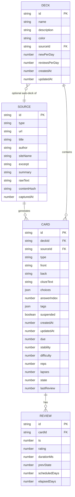

# Cramb — Database & Backend Schema

> **Status:** Draft v0.1 · **Last updated:** 2026-06-20

**Answers the question:** *How is data organized?*

> **Important framing:** Cramb v1 has **no server**. The "backend" is the extension's
> background service worker plus on-device storage. So this document covers: (1) the local
> data model, (2) the storage strategy, (3) the internal message "API" between extension
> surfaces, (4) the external LLM provider contract, (5) the export contract, and (6) a
> *forward-looking* optional sync API (post-v1, would change PRD non-goals).

---

## 1. Storage strategy

| Concern | Store | Rationale |
|---------|-------|-----------|
| Cards, decks, sources, review logs | **IndexedDB** (via Dexie) | Structured, queryable, handles thousands of records, async, large quota. |
| Settings (provider, model, limits, theme) | `chrome.storage.local` | Small, simple key/value; survives across surfaces; device-local. |
| **API key (secret)** | `chrome.storage.local` (device-local only) | Must NOT sync off-device. Read only in the background SW. Never in IndexedDB, never in page context. |
| Small cross-device prefs (optional, non-secret) | `chrome.storage.sync` | Only non-sensitive UI prefs, if desired. Never the key. |
| Transient capture payloads | In-memory + `chrome.storage.session` | Cleared on browser close; protects captured text in flight. |

**Why the key is segregated:** keeping the secret in `chrome.storage.local` (not synced, not in the DB export) limits blast radius and keeps it out of any data the user might share/export. See `CLAUDE.md` guardrails.

### 1.1 Quotas & pressure
- IndexedDB under the browser's per-origin quota (typically large; we request `navigator.storage.persist()` to avoid eviction).
- `source.rawText` is the heaviest field; it is **optional and prunable** — we keep a trimmed excerpt + summary, and can drop full raw text under storage pressure without losing cards.

### 1.2 Migrations
- Dexie versioned schema; each schema bump ships an explicit upgrade function.
- `meta.schemaVersion` row tracks the app data version independent of Dexie's store version, for data-shape migrations (e.g., adding FSRS fields).

---

## 2. Entity-relationship model



---

## 3. Tables (Dexie/IndexedDB)

### 3.1 `sources`
A captured piece of content.

| Field | Type | Notes |
|-------|------|-------|
| `id` | string (uuid) | PK |
| `type` | `'article' \| 'video' \| 'pdf' \| 'selection' \| 'manual'` | capture origin |
| `url` | string | canonical URL (or video URL) |
| `title` | string | page/video title |
| `author` | string? | best-effort |
| `siteName` | string? | e.g., "react.dev" |
| `excerpt` | string | short trimmed snippet for display |
| `summary` | string? | LLM one-paragraph summary |
| `rawText` | string? | extracted body; **prunable** |
| `contentHash` | string | sha-256 of normalized content → dedupe |
| `capturedAt` | number | epoch ms |

**Indexes:** `id`, `contentHash`, `capturedAt`, `type`.

### 3.2 `decks`
| Field | Type | Notes |
|-------|------|-------|
| `id` | string | PK |
| `name` | string | unique-ish (not enforced) |
| `description` | string? | |
| `color` | string | token name or hex |
| `sourceId` | string? | set when deck is an auto-deck for a source |
| `newPerDay` | number | default 20 |
| `reviewsPerDay` | number | default 200 |
| `createdAt` / `updatedAt` | number | |

**Indexes:** `id`, `name`, `sourceId`.

### 3.3 `cards`
The core entity. Carries its own FSRS scheduling state (denormalized for fast "due" queries).

| Field | Type | Notes |
|-------|------|-------|
| `id` | string | PK |
| `deckId` | string | FK → decks |
| `sourceId` | string? | FK → sources (provenance) |
| `type` | `'basic' \| 'cloze' \| 'mcq'` | |
| `front` | string (markdown) | prompt; for cloze, the templated text |
| `back` | string (markdown) | answer; for cloze, the revealed text |
| `clozeText` | string? | original cloze with `{{c1::…}}` markers |
| `choices` | string[]? | MCQ options |
| `answerIndex` | number? | MCQ correct index |
| `tags` | string[] | |
| `suspended` | boolean | excluded from review |
| `due` | number | epoch ms — **primary scheduling index** |
| `stability` | number | FSRS |
| `difficulty` | number | FSRS |
| `reps` | number | FSRS |
| `lapses` | number | FSRS |
| `state` | `0 new \| 1 learning \| 2 review \| 3 relearning` | FSRS |
| `lastReview` | number? | epoch ms |
| `createdAt` / `updatedAt` | number | |

**Indexes:** `id`, `deckId`, `sourceId`, `due`, `state`, `[deckId+due]` (compound, for "due in this deck"), `*tags` (multi-entry).

**Hot query (due cards):**
```js
// cards due now, respecting suspension, ordered by due
db.cards.where('due').belowOrEqual(Date.now())
        .and(c => !c.suspended)
        .sortBy('due')
```

### 3.4 `reviews`
Append-only log; powers FSRS optimization and stats.

| Field | Type | Notes |
|-------|------|-------|
| `id` | string | PK |
| `cardId` | string | FK → cards |
| `ts` | number | epoch ms |
| `rating` | `1 again \| 2 hard \| 3 good \| 4 easy` | |
| `durationMs` | number | time to answer |
| `prevState` | number | FSRS state before |
| `scheduledDays` | number | interval assigned |
| `elapsedDays` | number | since last review |

**Indexes:** `id`, `cardId`, `ts`.

### 3.5 `meta` (singleton-ish)
`{ key, value }` rows: `schemaVersion`, `installId` (random, local), `lastBackupAt`, `onboardingComplete`.

---

## 4. Settings shape (`chrome.storage.local`)

```ts
interface Settings {
  provider: 'openai' | 'anthropic' | 'google' | 'ollama';
  model: string;                 // e.g. provider-specific model id
  // apiKey stored under a SEPARATE key ('cramb.secret.apiKey') — see §1
  ollamaEndpoint: string;        // default 'http://localhost:11434'
  generation: {
    maxCardsPerCapture: number;  // default 8
    cardTypes: ('basic'|'cloze'|'mcq')[];
    cardContentFont: 'sans' | 'serif';
  };
  review: { newPerDay: number; reviewsPerDay: number; };
  appearance: { theme: 'dark' | 'light' | 'system' };
  privacy: { analyticsOptIn: boolean }; // default false
}
```

The secret is its own key so it can be written/cleared independently and excluded from any settings export:
```
cramb.settings   -> Settings (above)
cramb.secret.apiKey -> string   // never exported, never logged, background-only read
```

---

## 5. Internal message API (contracts between surfaces)

Surfaces communicate with the background service worker via typed messages (`chrome.runtime.sendMessage`). This is the closest thing to an "API" in v1. All messages share an envelope and are validated (e.g., with Zod).

```ts
type Msg =
  | { type: 'capture.fromSelection'; payload: { text: string; url: string; title: string } }
  | { type: 'capture.fromPage';      payload: { url: string } }            // SW asks content script to extract
  | { type: 'generate.cards';        payload: { sourceId: string; options: GenOptions } }
  | { type: 'cards.save';            payload: { deckId: string; cards: NewCard[] } }
  | { type: 'review.next';           payload: { deckId?: string } }
  | { type: 'review.grade';          payload: { cardId: string; rating: 1|2|3|4; durationMs: number } }
  | { type: 'deck.create';           payload: { name: string } }
  | { type: 'export.anki';           payload: { deckId: string } }
  | { type: 'model.test';            payload: {} };

interface Envelope<T=Msg> { id: string; msg: T; }
type Result<T> = { ok: true; data: T } | { ok: false; error: { code: string; message: string } };
```

**Error codes (canonical):** `NO_MODEL_CONFIG`, `INVALID_KEY`, `RATE_LIMITED`, `PROVIDER_ERROR`, `NETWORK_ERROR`, `EXTRACTION_EMPTY`, `BAD_LLM_OUTPUT`, `OLLAMA_UNREACHABLE`, `QUOTA_PRESSURE`. UI maps each to a friendly message (see App-Flow §7).

---

## 6. LLM provider contract (card generation)

The background SW calls the chosen provider with a **structured-output** request. We constrain the model to a JSON schema and validate the result; one auto-repair retry on failure.

### 6.1 Output schema (provider-agnostic)
```json
{
  "type": "object",
  "required": ["cards"],
  "properties": {
    "summary": { "type": "string" },
    "cards": {
      "type": "array",
      "maxItems": 12,
      "items": {
        "type": "object",
        "required": ["type", "front", "back"],
        "properties": {
          "type":   { "enum": ["basic", "cloze", "mcq"] },
          "front":  { "type": "string" },
          "back":   { "type": "string" },
          "clozeText": { "type": "string" },
          "choices":   { "type": "array", "items": { "type": "string" } },
          "answerIndex": { "type": "integer" },
          "tags": { "type": "array", "items": { "type": "string" } }
        }
      }
    }
  }
}
```

### 6.2 Provider adapter interface
Each provider implements one interface, so swapping is trivial and community-extensible:
```ts
interface LLMProvider {
  id: 'openai' | 'anthropic' | 'google' | 'ollama' | string;
  generateCards(input: {
    text: string; title?: string; url?: string; options: GenOptions;
  }): Promise<GeneratedCard[]>;
  testConnection(): Promise<{ ok: boolean; detail?: string }>;
}
```
Adapters normalize provider-specific request/response shapes and surface a uniform error taxonomy (§5). **This interface is the #1 contributor on-ramp.**

---

## 7. Export contract (Anki)

- **`.apkg` export:** generate a SQLite-backed Anki package in-memory and trigger a file download. Mapping:
  - `basic` → Anki Basic note (Front/Back).
  - `cloze` → Anki Cloze note (using `{{c1::…}}` from `clozeText`).
  - `mcq` → Basic note with choices rendered into Front, answer on Back (Anki has no native MCQ).
  - One Cramb deck → one Anki deck (name preserved). Tags carried over.
- **AnkiConnect (optional, later):** POST to `http://localhost:8765` `addNotes` when the user has AnkiConnect running. Detected, never required.
- **JSON export/import:** full portable backup `{ sources, decks, cards, reviews, schemaVersion }` (excludes settings + secret).

---

## 8. Permissions & data-access rules

### 8.1 Extension permissions (justified for store review)
| Permission | Why | Scope discipline |
|-----------|-----|------------------|
| `activeTab` | Read current tab content on user action (capture). | Preferred over broad host perms. |
| `scripting` | Inject the content extractor / toolbar on demand. | Only on user action. |
| `storage` | Settings + IndexedDB-adjacent prefs. | — |
| `sidePanel` | The workspace surface. | — |
| optional host permissions (`<all_urls>`) | Only if user enables "capture without clicking on any site". | **Optional**, requested on demand, off by default. |
| host: provider API domains | Background → provider HTTPS calls. | Exact domains per provider; `localhost` for Ollama. |

### 8.2 Data-access invariants (security)
1. The API key is read **only** in the background SW; content scripts and page contexts never receive it.
2. Captured content and cards never leave the device **except** the specific text sent to the user-chosen provider for generation (clearly disclosed).
3. No third-party analytics by default; opt-in only, and never includes card/source content.
4. All external calls are HTTPS (or `localhost` for Ollama).
5. Exports never include the secret key.

---

## 9. Forward-looking: optional sync API (POST-V1, not in scope)

If encrypted multi-device sync is added later, it would introduce a thin backend with **end-to-end encryption** (server stores ciphertext only). Sketch of the contract, documented now so the local schema stays sync-friendly (note the `updatedAt`/`id` on every table):

```
POST /v1/sync/push   { since: number, changes: EncryptedDelta[] }  -> { serverTime }
GET  /v1/sync/pull?since=<ts>                                       -> { changes: EncryptedDelta[], serverTime }
```
- Conflict resolution: last-write-wins per record using `updatedAt`, with a tombstone table for deletes.
- The client encrypts/decrypts; the server never sees plaintext or keys.
- Adopting this **changes PRD non-goals** and requires a privacy review.
